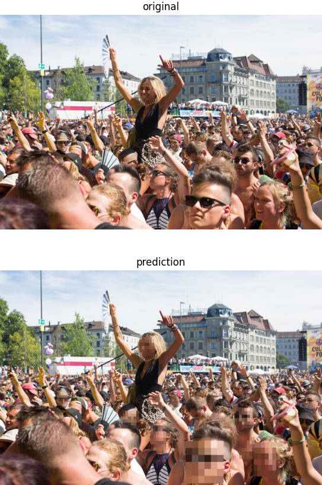

# Face-pixelizer

## Install

```
conda create -n face-pixelizer python=3.8
conda activate face-pixelizer
pip install -r requirements.txt
```

## Example

```
python face_pixelizer.py --image_path imgs/example_01.jpg
```


