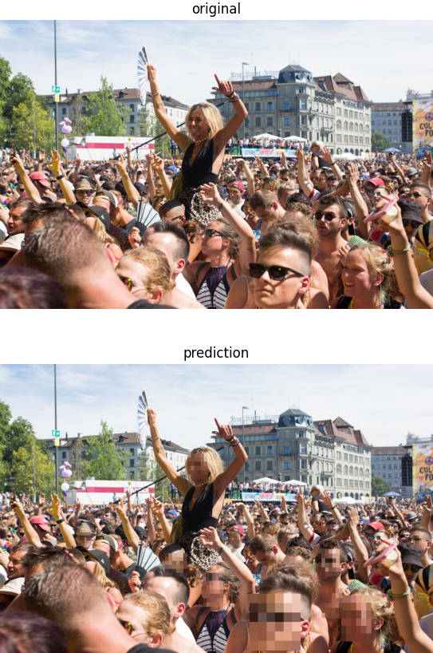

# Deployment of a deep learning model to isquare.ai - python tutorial
*In this tutorial, we will cover all steps to deploy a model written in python to isquare.ai. This tutorial’s duration is about 30mins, and is addressed at ML developers, software engineers or project managers who want to put their machine learning models into production in a few clicks.*

## Use case: Face Pixelizer
France recently passed a  new law, named "sécurité globale". It makes it illegal to publish pictures or videos showing policemen without anonymizing. We put ourselves in the case of a person who wants to make an app, permitting to stream and report events, including ones with policemen presence, but with an AI model blurring the faces directly. While understandable for their family and own security this law also makes it tricky to live report political events. Therefore, we developed a machine learning model which automatically blurs faces in any image, and is capable of doing so in real time. In this tutorial, we will show how to deploy this model efficiently with isquare.ai. We trained a simple face detection algorithm (retinaface) and changed it to blur the faces. When testing the model on a picture of the street parade, we see the algorithm in action. 



We won't go into the details of the code (which can be found [here](face_pixelizer.py)), but this is appliable to any model that is waiting to be deployed.

## Step 1: Make your code isquare compatible
*Before deploying our model, we have to make sure that it is compatible with the platform. From an existing model this is easily achieved in a few simple steps.*

### Step 1.1: Create your worker script
The first step is to make our code isquare compatible. The good news is that no code change is necessary, we just need to write a small script, which we will call the **worker script** from now on. This script contains one class, our **worker**:
```python
from archipel.workers.worker import ImagesToImagesWorker

from face_pixelizer import FacePixelizer


__task_class_name__ = "ArchipelFacePixelizer"


class ArchipelFacePixelizer(ImagesToImagesWorker):
    def add_model_specific_args(self, parent_parser):
        parent_parser.add_argument(
            "--input-size",
            default=1080,
            type=int,
            help="Network input size, imgs will resized in a square of this size",
        )
        parent_parser.add_argument(
            "--score-threshold",
            default=0.4,
            type=float,
            help="Discords all results with confidence score < score-threshold",
        )
        parent_parser.add_argument(
            "--nms-threshold",
            default=0.4,
            type=float,
            help="Discards all overlapping boxes with IoU > nms-threshold",
        )
        parent_parser.add_argument(
            "--state-dict",
            default="/opt/face_pixelizer/retinaface_mobilenet_0.25.pth",
            type=str,
            help="Path to pretrained weights",
        )

    def setup_model(self):
        self.model = FacePixelizer(
            self.args.input_size,
            self.args.score_threshold,
            self.args.nms_threshold,
            self.args.state_dict,
        )

    def forward(self, imgs):
        return self.model(imgs)
```
**Let's go through it step by step:** 

The imports specifies, along with any dependencies or additional functions or classes, which workertype we will be using. In our case, the model takes images as inputs and also return images (the same as before but the faces blurred), so we choose the `ImagesToImagesWorker`. The name of the workerclass always reflects inputs and outputs. For the moment, the following workers are available:
- `ImagesToImagesWorker` (e.g. Face blurring)
- `ImagesToDictsWorker` (e.g. classification or detection)
- `ImagesToStringsWorker` (e.g. for image annotation)
- `StringsToDictsWorker` (e.g. NLP model)
- `DictsToDictsWorker` (e.g. NLP model)
- `StringsToImagesWorker` (e.g. Image generation from captions)
- `DictsToImagesWorker` (e.g. Image generation from captions)
- `DictsToStringsWorker` (e.g. NLP model)
More types will be added on the way. If the input outputs types you are looking for are not available, please let us know by opening an issue. In the meantime know that most data formats can be converted to strings and dicts!

You can specify multiple classes and functions inside your workerscript (you can even write your whole code inside it, although we do not recommend it). The `__task_class_name__` specifies which class is your workerclass, in our case `ArchipelFacePixeliser`.

The worker class defines what is to be done when starting the model and during inference. The first step is to define your class, which inherits from a worker class:
```python
class ArchipelFacePixelizer(ImagesToImagesWorker):
```
Our model can be started with different arguments. For example, the threshhold defines from which confidence value the face is blurred, and we might want to change that value depending on the application, without deploying a new model.
```python
def add_model_specific_args(self, parent_parser):
        parent_parser.add_argument(
            "--input-size",
            default=1080,
            type=int,
            help="Network input size, imgs will resized in a square of this size",
        )
        parent_parser.add_argument(
            "--score-threshold",
            default=0.4,
            type=float,
            help="Discords all results with confidence score < score-threshold",
        )
```
Adding arguments works as with many CLI parsers in python. You specify a name, a default value, a type and a helper. These values can be modified directly when launching your model from isquare.ai.

When we start our model, some initializations have to be done. For example, we have to load our model to gpu and apply the arguments that were specified above. All these processes are handled in the `setup_model` method, which runs once at worker startup.
```python
def setup_model(self):
        self.model = FacePixelizer(
            self.args.input_size,
            self.args.score_threshold,
            self.args.nms_threshold,
            self.args.state_dict,
        )
```
In our case, we jus initialize our class with the correct arguments, but again, anything can be done here. The workers have full internet access by default, so you could download the weights, check the weather, run a cold start, or anything else.

The last thing we need to define is our model's forward pass, which is represented by the forward method of the worker. It's here that the inference happens:
```python
def forward(self, imgs):
    return self.model(imgs)
```

In our case, it just calls the `__call__` method of our model, but again, anything is accepted, as long as input and output types are respected.
We strongly recommend that you implement batched inference for your model, since this will allow you to save costs by increasing the efficiency of your model. Workers will take batches as **python lists** of inputs.

And that's all you need to get going from the code point of view. Let's proceed, setup our environment and deploy our model!

### Step 1.2: Set up your environment
Most deep learning models are not coded from scratch and depend on external libraries (e.g. pytorch, tensorflow). With isquare.ai, all requirements are handled by a Dockerfile, which is basically a set of instructions which sets up an environment. If you’re new to Docker, check the [documentation](https://docs.docker.com/engine/reference/builder/). We need to create a file containing Docker instructions (usually called Dockerfile):
```dockerfile
FROM alpineintuition/archipel-base-cpu:latest

COPY requirements.txt requirements.txt
RUN pip install -r requirements.txt

ARG FACE_PIXELIZER=/opt/face_pixelizer
RUN mkdir ${FACE_PIXELIZER}
COPY face_pixelizer.py ${FACE_PIXELIZER}
COPY retinaface.py ${FACE_PIXELIZER}
COPY utils.py ${FACE_PIXELIZER}
ENV PYTHONPATH="${FACE_PIXELIZER}:${PYTHONPATH}"
COPY "retinaface_mobilenet_0.25.pth" "${FACE_PIXELIZER}/retinaface_mobilenet_0.25.pth"

```
**Let's go through it step by step:**

Our face pixelizer was build with pytorch and has following python dependencies:
```
albumentations==0.5.1
matplotlib==3.4.1
numpy==1.19.2
torch==1.7.0
torchvision==0.8.1
``` 
These are saved to a file at the root of the directory, called `requirements.txt`. Other than the dependencies, we also have the weights (`retinaface_mobilenet_0.25.pth`) of the trained model which are located at the root of our repository, along with the requirements file. 
Now that we have everything we need, let's write a Dockerfile. We start by specifying the base image:
```dockerfile
FROM alpineintuition/archipel-base-gpu:latest
```
Isquare.ai provides two base images, that you have the choice between `archipel-base-gpu` and `archipel-base-cpu`. As their names suggest, one is optimized for GPU usage and the other for CPU usage. Since our model was trained on GPU and is adapted for GPU inference, we choose `archipel-base-gpu`.

The next step is to install all our python packages. To do this, we copy the requirements file we created earlier, and install it with pip:
```dockerfile
COPY requirements.txt requirements.txt
RUN pip install -r requirements.txt
```

Our worker depends on some external scripts, so let's create a folder for them and copy them.
```dockerfile
ARG FACE_PIXELIZER=/opt/face_pixelizer
RUN mkdir ${FACE_PIXELIZER}
COPY face_pixelizer.py ${FACE_PIXELIZER}
COPY retinaface.py ${FACE_PIXELIZER}
COPY utils.py ${FACE_PIXELIZER}
ENV PYTHONPATH="${FACE_PIXELIZER}:${PYTHONPATH}"
```
We simply create a folder at `/opt/`  and copy our files. The last lines adds the folder to the `PYTHONPATH`, allowing easy imports of all utilities.

The last steps is to copy our weights:

```dockerfile
COPY "retinaface_mobilenet_0.25.pth" "${FACE_PIXELIZER}/retinaface_mobilenet_0.25.pth"
```

And that's it!
## Step 2: Deploy your model
*Congratulations! you've adapted your code to make it isquare compatible. Once used to it, it'll take only a few minutes to make your model isquare-compatible. The next step is deploying the model on our servers.* (Comming soon)
### Step 2.1: Login to isquare.ai
You can login into isquare.ai using your google or github account.
TODO: Images, finalize when platform UX is final
### Step 2.2: Build using a git repository
TODO: Images, finalize when platform UX is final
### Step 2.3: Deployment, usage and access
To deploy your model once it is built, just click the "START button.
When choosing one of your deployed models, you can choose to add an access key. Once this key is generated, you can use yoyur model, as explained in [here](getting_started.md).


## Step 3: Monitor usage and optimize your model
Since the "sécurité globale" amendment on the interdiction to show the faces of policeman did not pass, our model is used way less than expected, and we're looking to reduce costs. We can tradeoff a bit of the performance of the model for a cost optimization by migrating the model to CPU. Since our model automatically detects if a gpu is present, we only need to change the first line of our Dockerfile from
```dockerfile
FROM alpineintuition/archipel-base-gpu:latest
```
to
```dockerfile
FROM alpineintuition/archipel-base-cpu:latest
```
We've just saved costs by changing one letter in the dockerfile!

Additionaly, we're not sure how good our model performs and we've had a few complaints, and we would like to monitor the threshold values for our predictions. We think their might be a model drift, and that the threshold for the test data is not adapted to a real life scenario.

Monitoring this value is very simple to achieve. Inside your forward method, we just add:
```python
self.log(threshold_value)
```
This value is now logged, and you can retrieve it on your dashboard on isquare.ai. In this way, the parameters of the model can be adpated to fit the real life data, and the real performance of the model assessed. 
We highly encourage monitoring apropriate metrics for your model, in this way you'll always know how well your model is really performing.

## Advanced usage

### Defining an example input
Isquare will automatically test your model by generating an input corresponding to your worker class, with one exception: All `DictsToXWorker` workers. It could also be that you want to test your worker with a very specific input. In either of those cases, you can override the `get_dump_input` method of your worker, for example, as follows:
```python
class MusicalTastePredictor(DictsToDictsWorker):
    """Predicts musical taste from completely arbitrary information."""
    ...
    ...
    def get_dump_input(self):
        return {"Name":"John","Origin": "Switzerland","Age":18}

```


